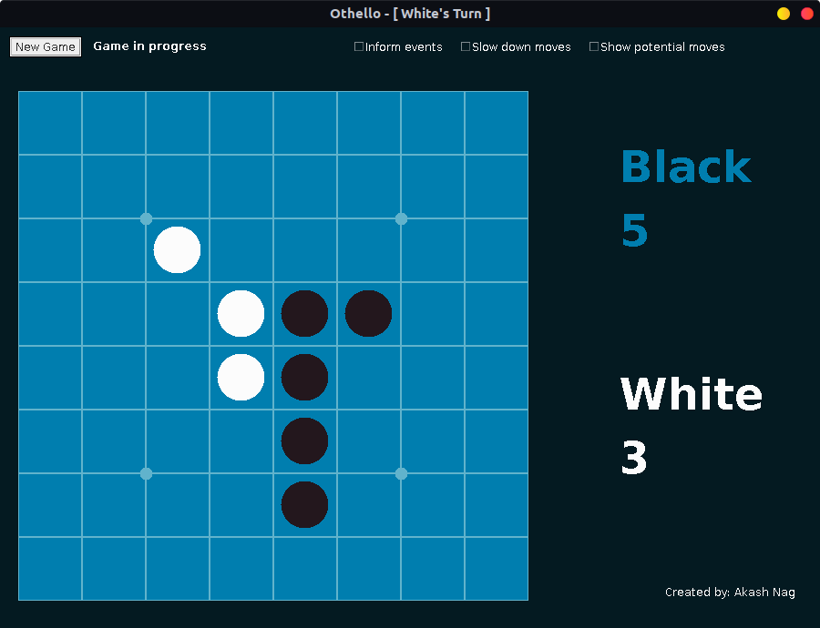

Othello
=======

Othello is a board game, also called Reversi. The objective is to convert as many pieces you can to your own color (black or white). In this game, you can play against the computer or against another player (local).

### Browsing the Code

Open the `Othello` directory under `src` in Netbeans to view the code.

### Usage example

```bash
$ cd src/Othello/dist
$ java -jar Othello.jar
```

### Screenshot



### License

The application is licensed under the MIT License. Copyright &copy; Akash Nag.